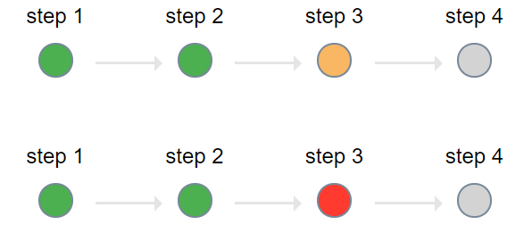

# step-indicator
a simple step indicator



#### Usage:

It has four state: `success`, `failed`, `active`, `pending`


``` html
    <ul class="step-indicator">
        <li class="success">
            <div class="caption">step 1</div>
            <div class="step"></div>
            <span class="arrow"></span>
        </li>
        <li class="success">
            <div class="caption">step 2</div>
            <div class="step"></div>
            <span class="arrow"></span>
        </li>
        <li class="active">
            <div class="caption">step 2</div>
            <div class="step"></div>
            <span class="arrow"></span>
        </li>
        <li class="pending">
            <div class="caption">step 3</div>
            <div class="step"></div>
        </li>
    </ul>
```